# Fixed-Token Chunking Evaluation

## Technical Details

### Starting point

I began by looking into Chroma's code repository linked to their paper. It was a good first step, helping me figure out how to structure my own evaluation code.


### Tools

#### Vector Database: **Chroma**

To keep it consistent with their code, I've also used **Chroma** for **vector databases**. Their documentation wasn't great. [Milvus](https://milvus.io/docs) seems like a better alternative from my personal experience.

#### Tracking Experiments: **Weights and Biases**

As you'll see in the following sections, I've incorporated multiple visualizations. To keep all results organized and easy to interpret, I've integrated [Weights and Biases](https://wandb.ai/site/). This platform enables interactive visualization (e.g., through pyplot), supports storage of various media like tables, plots, and images, allows storage of configuration files, and facilitates report writing. Additionally, all these artifacts can be easily shared with the team, making it straightforward to compare different experiments—including evaluation experiments like the ones conducted here.

## Run the experiments

### 1. Install Requirements

```bash
pip install -r requirements.txt
```

### 2. Configure experiments

You can configure the experiments by editing the `config.yaml` file. To reproduce the results, keep the default values.

### 3. Configure Weights and Biases

Add your [Weights and Biases](https://docs.wandb.ai/quickstart/) API key to environment variable `WANDB_API_KEY`.

If you don't want to use Weights and Biases, you can set `paths/wandb` to `null` in the `config.yaml` file.

### 3. Run the experiments

```bash
python main.py
```

### 4. Check the results

The results are stored in the `experiments` folder. It has the following structure (image files are not included):

```
experiments
├── questions
│   ├── statistics.json   # statistics about questions_df.csv file
├── results
│   ├── heatmaps          # heatmap visualizations
│   │   ├── interpolated  # with interpolated values
│   │   ├── original      # with original values
|   ├── trends            # plots for trends in hyperparameter across metrics
│   ├── metrics.csv       # metrics table
```

## Evaluation

### Choice of Corpora

For not any particularly reason, I chose the **State of the Union** dataset. I might as well have chosen another one.

### Questions + Excerpts Exploration

Before running evaluations on different configurations for chunkers and the number of retrieved chunks, I plotted exploratory information, such as the length of the excerpts/references and the number of excerpts per question. This helped me get a better feel for the evaluation dataset.

<p align="middle">
  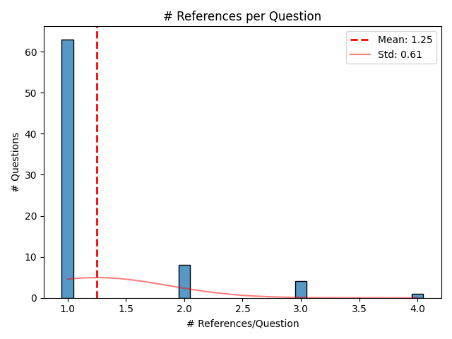
  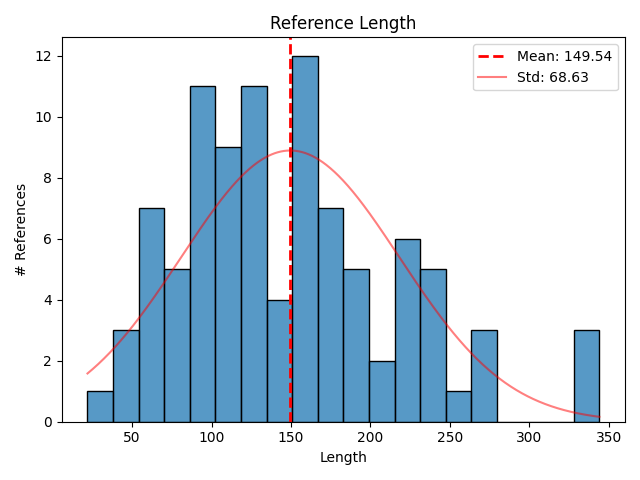 
</p>


### Some Remarks

#### Presentation of Results

In their paper, Chroma compared results using large tables. Of course, their experiments involved multiple chunking algorithms whereas our use case is much simpler than that. However, humans have difficulty processing large numeric tables due to limitations in pre-attentive cognition, especially when visual encodings are lacking. To address this, I decided to complement the results tables with visualizations, making it easier to draw clear conclusions from the evaluation.

#### Choice of Hyperparameters

In their paper, Chroma selected a representative set of hyperparameter configurations to explore the effectiveness of the chunkers. However, since I'm also using visual encodings to represent my results, I found it necessary to perform a more granular exploration of the hyperparameter space (`chunk size`, `chunk overlap` and `# retrieved chunks`), similar to a grid search. Given that the dataset is relatively small and primarily used for hypothesis testing, performing a more detailed search within this hyperparameter space was both feasible and beneficial.

Concretely, I've used the following ranges:

- **chunk size**: `range(50, 500, 50)`
- **chunk overlap**: `range(0, 250, 25)`
- **# retrieved chunks**: `range(1, 10)`

with `range(50, 500, 50)` → [50, 100, 150, ..., 500] (regular python `range` function but including the end value).

**Note**: We get the configurations of form `(chunk size, chunk overlap, # retrieved chunks)` by taking all combinations and filter them on the condition that `chunk overlap <= chunk size / 2`.

## Results

### Recall vs Precision trade-off

In most cases, recall tends to improve at the expense of lower precision. This trend is visible in the scatter plot below, which shows a negative correlation between the two metrics:

<p align="middle">
  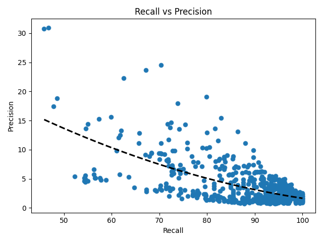
</p>

#### Number of chunks: Dominating Hyperparameter

The number of retrieved chunks plays an important role in shaping both recall and precision. As the number of chunks increases, recall improves. This makes intuitive sense, since fetching more chunks raises the chances of including the relevant parts of the corpus. However, this comes at the cost of precision, which drops significantly. This trade-off is especially pronounced in the case when the relevant information for a question is often concentrated in specific parts of the document rather than being evenly spread throughout. So while more chunks help capture the right content, they also flood the output with unrelated pieces, reducing overall precision, as it can be seen in this plot:

<p align="middle">
  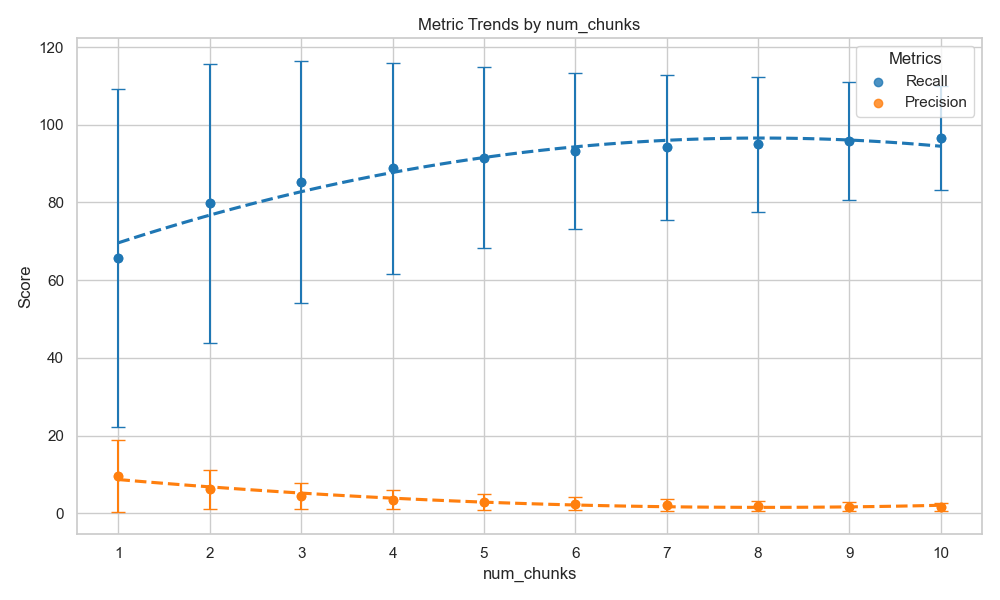
</p>

A different visualization that reinforces this trend is shown below. Here, we fix the number of retrieved chunks and observe how different combinations of chunk_size and chunk_overlap affect recall and precision. As we increase num_chunks from 1 to 10 (we're showing only the first five for clarity), any patterns that emerge in the lower settings start to flatten out. This saturation effect highlights once again that num_chunks dominates the behavior of both recall and precision, regardless of how we tweak the other two parameters.

<p align="middle">
  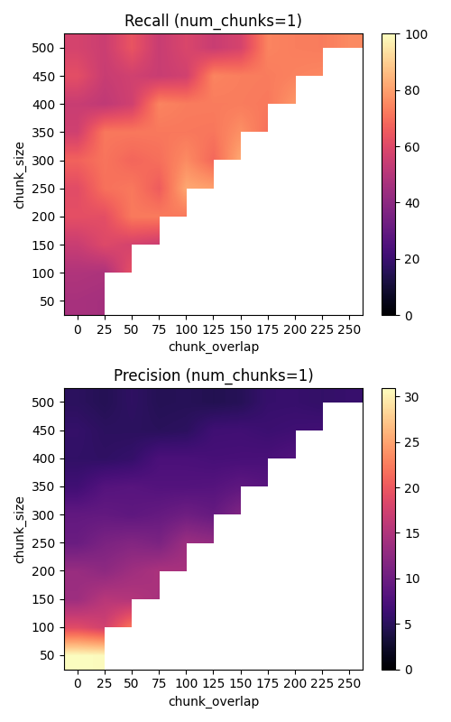
  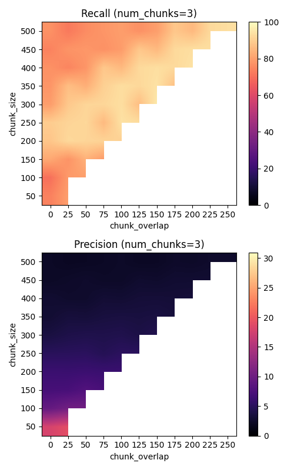 
  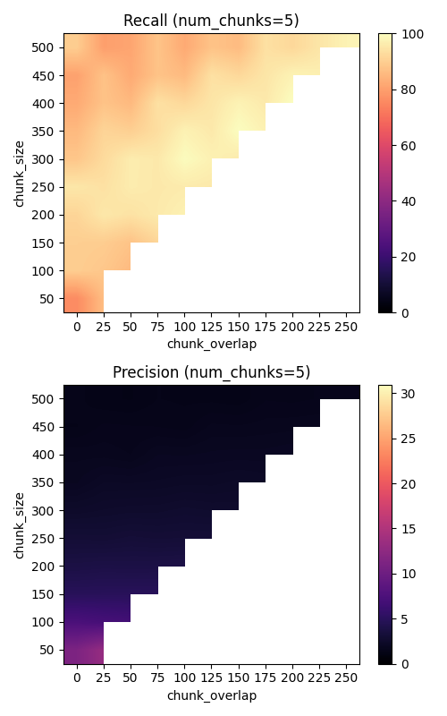 
  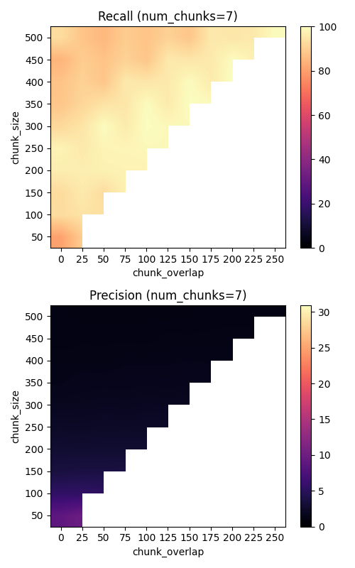
  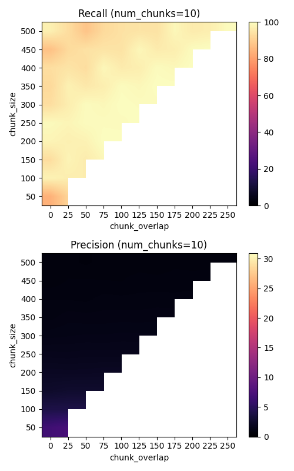 
</p>

### Num of chunks vs Chunk size

The bottom-left region of the plots—where both chunk size is small (<~100) and number of chunks is low (<~3)—shows the highest precision scores. This makes sense: small chunk sizes allow for more granular retrieval, making it easier *to pinpoint* the exact information relevant to a question. At the same time, a low number of chunks forces the RAG pipeline to be highly selective, ideally surfacing only the most relevant pieces—assuming the embeddings are doing a good job capturing semantic similarity.

However, this precision boost comes at the expense of recall. When the context needed to answer a question is broader or spread across multiple sections, this strict locality (small chunks + few retrieved) means the pipeline simply won’t retrieve enough context to cover it fully.

By increasing the number of chunks while keeping the chunk size fixed (moving from the bottom-left to the bottom-right), we see an improvement in recall with only a moderate drop in precision. This happens because the pipeline is now able to retrieve more context overall, while still benefiting from the granularity of small chunks, which helps it pick out relevant information more precisely. It's a kind of middle ground—gaining coverage without completely sacrificing precision.

However, increasing only the chunk size (shifting from bottom-left to top-left) doesn't lead to a significant boost in recall. This is likely because in many cases, the relevant context isn’t located in one continuous span—so larger chunks just end up bundling unrelated content together. On top of that, larger chunks tend to dilute the semantic clarity captured by embeddings, making them less effective for retrieval.

Finally, increasing both chunk size and number of chunks (moving toward the top-right corner) is kind of a no-brainer in terms of recall—it gives the pipeline a much broader view of the corpus. But this comes at a heavy cost to precision, as it floods the output with a lot of irrelevant context.

<p align="middle">
  <!-- 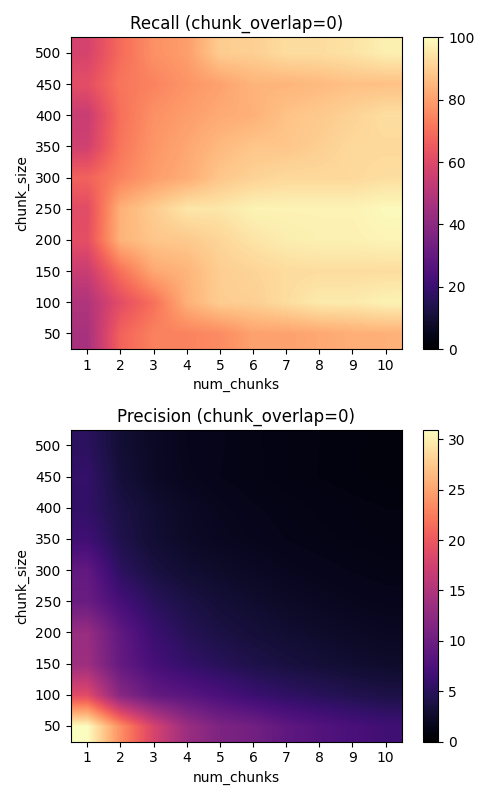  -->
  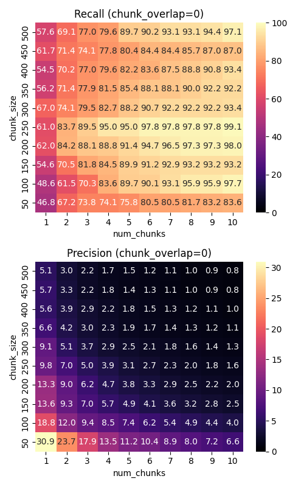
</p>

### Chunk overlap

One interesting observation is that overlapping chunks tend to improve both recall and precision (at a smaller scale but at least it doesn't drop). Overlap respects the continuous nature of natural language, meaning it’s more likely that a chunk captures a complete thought or context window, rather than cutting important information mid-sentence. This naturally leads to higher recall, since there's a better chance of the relevant context being retrieved somewhere across the overlapping regions.

As for precision, while chunk overlap doesn’t change the number of retrieved tokens (assuming fixed chunk_size and num_chunks), it can still help improve the relevance of the retrieved content. If the overlap allows the chunk to include more semantically rich or complete information, it increases the chance that what’s retrieved actually aligns with the question—raising the precision. So while precision isn’t affected by overlap in a purely mechanical way (like it is with number of chunks and chunk size), it benefits indirectly through better chunk quality, which ties back into the improved recall.

<p align="middle">
  <!-- 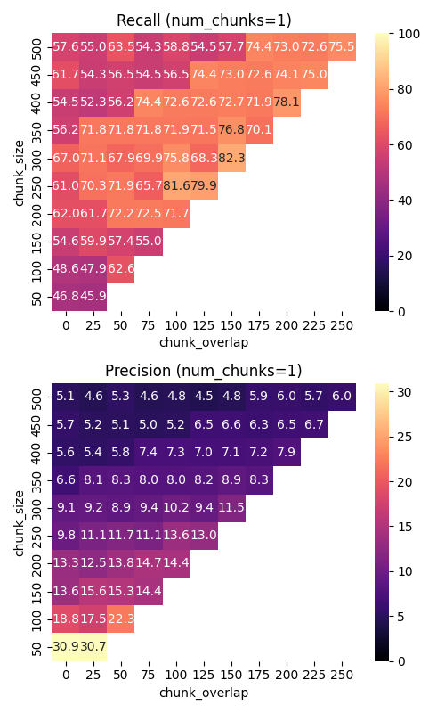
  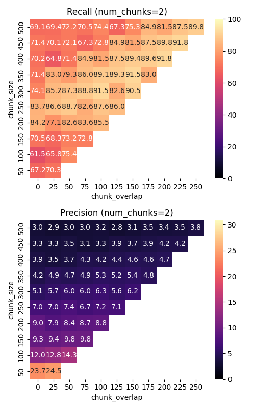  -->
  
  <!-- 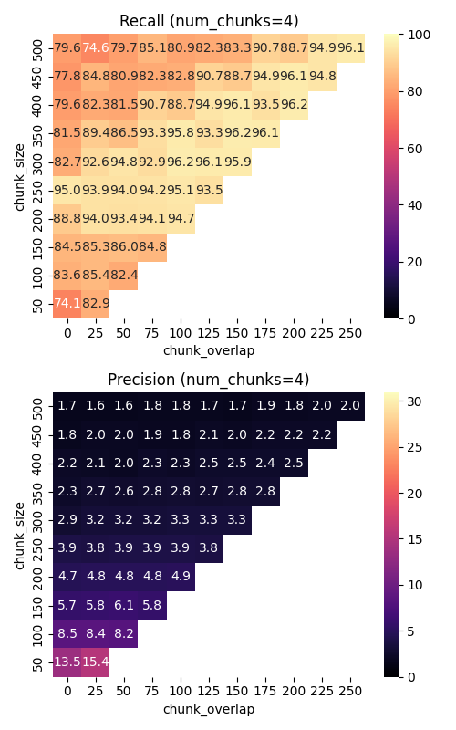
     -->
</p>


### Is there a sweet spot?

It depends. I’d argue that recall is more important than precision, especially in the context of modern LLMs. These models are pretty good at handling noisy input—they can sift through multiple retrieved chunks and still “pick out” the most relevant parts for answering a question. So even if the retrieved content includes some irrelevant context, the model can often work around it.

But if recall is low, and the truly relevant information is not included in the retrieved set, the LLM lacks the necessary context to produce a reliable answer. This limitation becomes especially critical in high-stakes domains such as medical or legal applications, where missing key information can result in inaccurate or misleading outputs. In such scenarios, maximizing recall is generally the more reliable strategy.